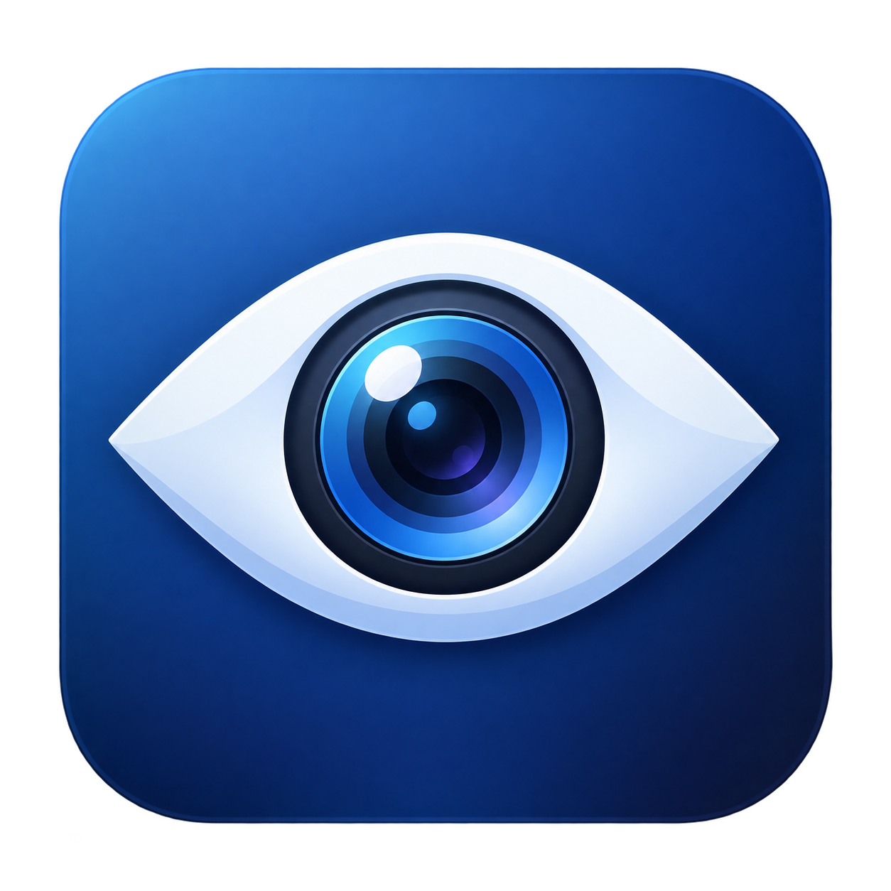

# Remote Eye Contact



把 Mac 摄像头送到 Windows 的 NVIDIA Broadcast 做眼神矫正，再回传成 Mac 上的虚拟摄像头。**固定 720p / 30 fps，仅视频，不处理麦克风。**

Mac 用菜单栏应用，Windows 用一个服务控制窗口；运行时无需打开 OBS，也不需要 SSH、Python 或命令行。


## 下载与首次准备

从 [Releases](https://github.com/norbertm2050/mac_nvbroadcast_eyecontact/releases) 下载对应压缩包。

- **Mac：Apple Silicon，macOS 14 或更新。** Intel Mac 暂无发行包。本机实际验证为 Apple Silicon / macOS 26；其他系统版本请先试用。
- **Windows：64 位 Windows 10/11，能运行当前 NVIDIA Broadcast 的 RTX GPU、相应显卡驱动。** 先从 [NVIDIA 官网](https://www.nvidia.com/en-us/geforce/broadcasting/broadcast-app/) 安装 Broadcast。
- 两端从 [OBS 官网](https://obsproject.com/download) 安装 OBS Studio。Mac 首次运行 OBS，启用一次 Virtual Camera，并在系统设置批准 OBS 摄像头扩展；Windows 安装程序会安装虚拟摄像头驱动。完成后关闭 OBS。**本项目使用其驱动，不需要运行 OBS 应用。**

虚拟摄像头驱动、GPU 驱动和 NVIDIA Broadcast 不能随本项目自动免授权安装。完成这一次准备后，两端发行包均可解压点击运行。

发行包目前没有 Apple Developer ID 公证或 Windows 商业代码签名。macOS 首次下载打开可能需要在“系统设置 → 隐私与安全性”允许打开；Windows 可能显示未知发布者提示。确认下载自本仓库的 Release，并核对 SHA256SUMS。不要关闭系统整体安全保护。

## Windows 端

1. 完整解压 Windows 压缩包到可长期保留的位置，双击 `RemoteEyeContact.exe`。旁边的 `_internal` 和 `mediamtx.exe` 是运行时的一部分，不要只移动 `.exe`。
2. 打开 NVIDIA Broadcast，在“摄像头”选择 **OBS Virtual Camera**，设为 **1280×720 / 30 fps**，只开启 **Eye Contact / 眼神接触** 效果。可以将 Broadcast 最小化。
3. 在 Remote Eye Contact 点击“启动服务”。默认勾选“登录 Windows 后自动启动服务”，之后会自动启动并最小化，同时自动拉起 NVIDIA Broadcast。首次出现防火墙提示时，允许实际使用的网络。连接不上时，可点“设置防火墙”并批准系统管理员提示；助手只允许局域网和 Tailscale 网段访问所选 TCP 端口。不要把 RTSP 端口转发到公网。
4. 记下窗口中的可达 IP（或你自己的 Tailscale 主机名）、端口和连接码。连接码保存在本机，每次打开不会变化。

服务运行时应用会请求 Windows 保持唤醒（允许显示器熄灭），停止服务时释放该请求。需要停用自动启动时，取消应用中的勾选；移动整个 Windows 应用文件夹后，手动打开一次即可更新自动启动路径。

**开机完全无人值守**：NVIDIA Broadcast 需要交互式桌面会话，应用的“自动启动”指登录 Windows 后运行。若机器停在登录界面，需要由机主另外配置 Windows 自动登录，例如使用 [Microsoft Sysinternals Autologon](https://learn.microsoft.com/en-us/sysinternals/downloads/autologon)。本应用不索取、不保存 Windows 登录密码，也不会替所有用户更改登录安全策略。自动登录会让开机直接进入账号，请按你对这台机器的访问控制要求决定。Windows 更新、BitLocker 恢复提示等启动前提示仍可能需要人工处理。

Windows 必须保持登录到桌面、网络可达。远程桌面会话切换、锁屏及显卡驱动更新可能影响虚拟摄像头/硬件加速；实际行为取决于驱动和 Broadcast。

## Mac 端

1. 解压后将 **整个 `Remote Eye Contact.app`** 拖到“应用程序”或其他位置，双击打开。**这个 `.app` 可以独立移走使用，不依赖源码目录或 Python 环境。**
2. 首次在设置窗口填 Windows 的 **IP/主机名、端口、连接码**，选择 Mac 摄像头，点击“保存并启动”。允许摄像头访问。
3. 等菜单栏显示“眼神矫正已就绪 · 720p30”。预热阶段输出黑画面，避免把不稳定或过期帧送到会议。
4. 在会议软件中选择 **OBS Virtual Camera**。麦克风继续选你平时使用的麦克风。
5. 菜单只有一个切换项：运行时显示“停止眼神矫正”，停止后显示“启动眼神矫正”。授权及停止过程中禁用重复点击。停止后才能修改连接设置。

退出 Mac 应用会释放 Mac 摄像头；Windows 服务独立运行，可在 Windows 点击“停止服务”释放其视频工作进程；该操作取消本次会话的自动重试，之后仍按自动启动设置在下次登录运行。关闭 Windows 控制窗口也会停止服务。

## 网络与隐私

- 同一局域网优先填 Windows 的局域网 IP。跨网络可使用你自己配置的 Tailscale 地址；两端都要能互相访问。
- Mac 使用 Tailscale 地址时，会自动恢复已登录但处于断开状态的 Tailscale 连接；需要登录或设备授权时，菜单会提示你手动完成。视频正常后不再轮询 Tailscale。停止眼神矫正不会断开系统的 Tailscale 网络。
- 默认只使用 TCP **8554**，可在两端改为同一个端口。不开放 Web 管理接口。
- 首次仅需填写一次地址与随机连接码；没有内置服务器地址、账号、密码或 SSH 密钥。
- RTSP 连接码用于访问认证，**普通局域网 RTSP 本身不加密视频**。请使用可信局域网；跨网络使用 Tailscale 等加密通道，不要直接暴露公网。
- 视频只在你配置的两台电脑间传输；应用不录制视频、不上传云服务、不采集音频。日志只记录运行状态和错误，但可能包含你填写的地址或设备名称；分享日志前请检查。
- Mac 配置/日志：`~/Library/Application Support/Remote Eye Contact/`。
- Windows 配置/日志：`%LOCALAPPDATA%\Remote Eye Contact\`。
- 更换连接码：停止两端应用，删除 Windows 配置目录中的 `config.json` 后重新打开，随后在 Mac 更新连接码。不要把这两个本地配置目录提交到 Git。

## 性能

VideoToolbox 编码/解码、Windows D3D11VA 解码、NVENC 低延迟编码；两程目标码率各 6 Mbps。各阶段只保留最新帧，不堆积旧画面。断线后从关键帧重新解码，视频恢复并稳定预热后再输出。

发布前原生链路在一组 Apple Silicon Mac + RTX 3070 Laptop、局域网环境中测得约 **187 ms 中位数 / 238 ms P95**（120 秒，3504 个有效样本）。这是从 Mac 软件帧时间戳到虚拟摄像头读回的测量，**不包含传感器曝光、屏幕显示和会议软件缓冲**，也不是所有设备的保证值。便携发行包验证结果见 [测试记录](docs/VALIDATION.md)。

## 故障排查

- **Windows 重启后连不上**：确认已进入用户桌面，任务管理器 → 启动应用中没有禁用 RemoteEyeContact，且安装路径未被删除。应用设置的登录自动启动不会跳过 Windows 密码/PIN。

- **一直等待 Windows 视频**：先确认 Windows 服务已启动、地址/端口/连接码一致、防火墙放行，再检查 Broadcast 输入和眼神效果。通过两端“运行日志”查看错误。
- **端口占用**：先停止旧版服务，或修改两端端口。不自动结束其他应用的进程。
- **虚拟摄像头找不到/创建失败**：完成 OBS 驱动安装，退出仍在使用虚拟摄像头的 OBS 实例，再重开会议软件。Mac 摄像头扩展需要系统授权。
- **Mac 摄像头不能打开**：系统设置 → 隐私与安全性 → 摄像头，允许本应用；确认没有其他程序独占摄像头。
- **画面一直黑**：先检查两端是否持续接近 30 fps；只有连接恢复并完成预热才会正式输出。
- **未自动关闭终端**：发行版不使用 `.command` 脚本，不会打开终端。
- **停止时短暂等待**：最多等待约 7 秒释放采集/网络调用，随后结束本应用自己的工作进程。

## 从源码构建

源码自有代码采用 MIT；捆绑依赖保留各自许可证。详见 [第三方说明](THIRD_PARTY_NOTICES.md) 与 [依赖源码](docs/DEPENDENCIES.md)。不要删除发行包中的第三方许可证。NVIDIA Broadcast 与 OBS 安装程序不包含在包内。

构建需要 Python 3.12。macOS 还需 Xcode Command Line Tools，Windows 需要包含 Tk 的标准 Python 安装。

```sh
# macOS ARM64
python3.12 -m venv .venv
.venv/bin/python -m pip install -r requirements-mac.txt
.venv/bin/python scripts/collect-licenses.py
PYTHON="$PWD/.venv/bin/python" scripts/build-mac.sh
```

```powershell
# Windows x64
py -3.12 -m venv .venv
.venv\Scripts\python -m pip install -r requirements-windows.txt
.venv\Scripts\python scripts/collect-licenses.py
.venv\Scripts\python scripts/fetch-mediamtx.py
$env:EYE_BUILD_PYTHON = "$PWD\.venv\Scripts\python.exe"
powershell -ExecutionPolicy Bypass -File scripts/build-windows.ps1
```

测试：`python -m unittest discover -s tests -v`。编译产物写入 `dist/`，不进入 Git。

本项目与 NVIDIA、OBS、Apple、Tailscale 无隶属关系。眼神矫正的质量、支持硬件和可用效果由 NVIDIA Broadcast 决定。
